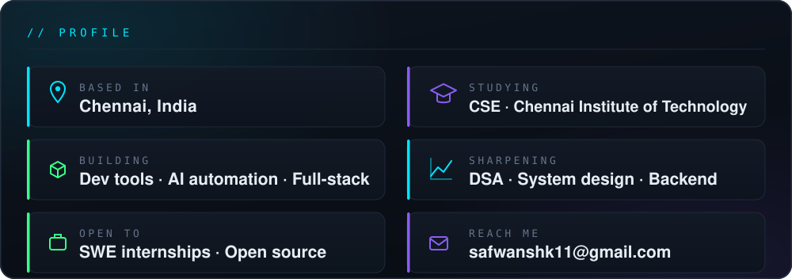
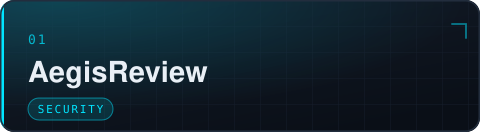
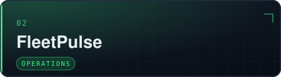
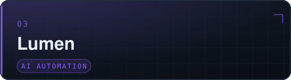
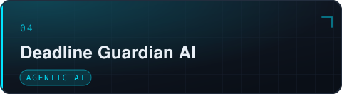
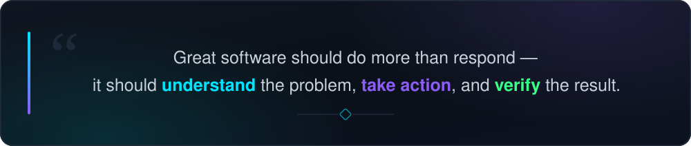

  

<a href="https://github.com/safwanshk11">
  <picture>
    <source media="(prefers-color-scheme: dark)" srcset="https://readme-typing-svg.demolab.com?font=JetBrains+Mono&weight=600&size=21&duration=2600&pause=700&color=00E5FF&center=true&vCenter=true&width=640&height=52&lines=Full-Stack+Developer;AI+%26+Automation+Builder;Open-Source+Contributor;Hackathon+Finalist;Turning+ideas+into+working+systems">
    <source media="(prefers-color-scheme: light)" srcset="https://readme-typing-svg.demolab.com?font=JetBrains+Mono&weight=600&size=21&duration=2600&pause=700&color=0891B2&center=true&vCenter=true&width=640&height=52&lines=Full-Stack+Developer;AI+%26+Automation+Builder;Open-Source+Contributor;Hackathon+Finalist;Turning+ideas+into+working+systems">
    
  </picture>
</a>

 

  

  

  

  

<picture>
  <source media="(max-width: 600px)" srcset="assets/about-mobile.svg">
  
</picture>

  

<picture>
  <source media="(max-width: 600px)" srcset="assets/mission-mobile.svg">
  
</picture>

---

## Featured Builds

<table>
<tr>

<td width="50%" valign="top">

Paste any public GitHub repository and get a severity-scored security report in seconds — hardcoded secrets, SQL injection, unsafe HTML rendering and vulnerable dependencies — with an opt-in AI agent that plans, drafts and self-reviews a fix for each finding.

<code>Python</code> <code>FastAPI</code> <code>React + TypeScript</code> <code>SSE</code>

</td>

<td width="50%" valign="top">

Built for the Odoo Hackathon TransitOps problem statement — replaces fleet spreadsheets with one operational system for vehicles, drivers, trips, maintenance and expenses, enforcing rules like licence validity and load limits on the server rather than trusting the UI.

<code>Node.js</code> <code>Express</code> <code>PostgreSQL</code> <code>React</code>

</td>

</tr>
<tr>

<td width="50%" valign="top">

Turns cryptic industrial catalogue rows such as <code>3/8 CPLG BRS 150#</code> into structured, commerce-ready product records — deterministic rules where rules are safer, AI where language actually helps, and a confidence score plus rationale attached to every field.

<code>Python</code> <code>FastAPI</code> <code>React + TypeScript</code> <code>SQLAlchemy</code>

</td>

<td width="50%" valign="top">

An active deadline defence system instead of another checklist — it scores schedule risk across a whole task portfolio, breaks vague objectives into timed subtasks, and assembles an hour-by-hour daily plan with buffer blocks built in.

<code>TypeScript</code> <code>React</code> <code>Gemini</code> <code>Firebase</code>

</td>

</tr>
</table>

More work — an autonomous planning agent, an AI support-triage inbox and a crowd-safety prototype — lives on my <a href="https://github.com/safwanshk11?tab=repositories">repositories page</a>.

---

## Toolbox

<b>LANGUAGES</b> 
     

<b>FRONTEND</b> 
  

<b>BACKEND</b> 
   

<b>DATA</b> 
   

<b>AI</b> 
    

<b>TOOLS &amp; CLOUD</b> 
     

---

## GitHub Analytics

  

 

Cards are generated live. If a provider is temporarily down, the full history is on my <a href="https://github.com/safwanshk11">GitHub profile</a>.

---

## Contribution Graph

<picture>
  <source media="(prefers-color-scheme: dark)" srcset="https://raw.githubusercontent.com/safwanshk11/safwanshk11/output/github-snake-dark.svg">
  <source media="(prefers-color-scheme: light)" srcset="https://raw.githubusercontent.com/safwanshk11/safwanshk11/output/github-snake.svg">
  
</picture>

---

---

## Let's Build Something

**Have an interesting idea, internship opportunity or open-source project?** 
Let's build something useful.

 

  

